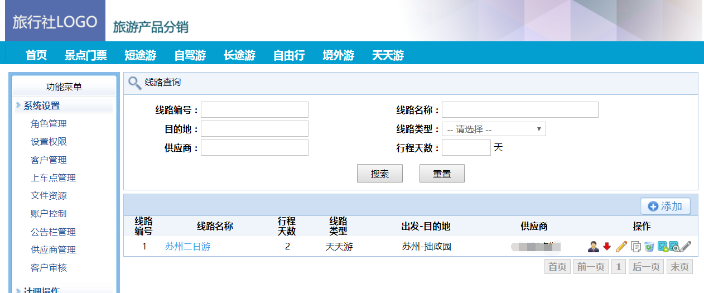
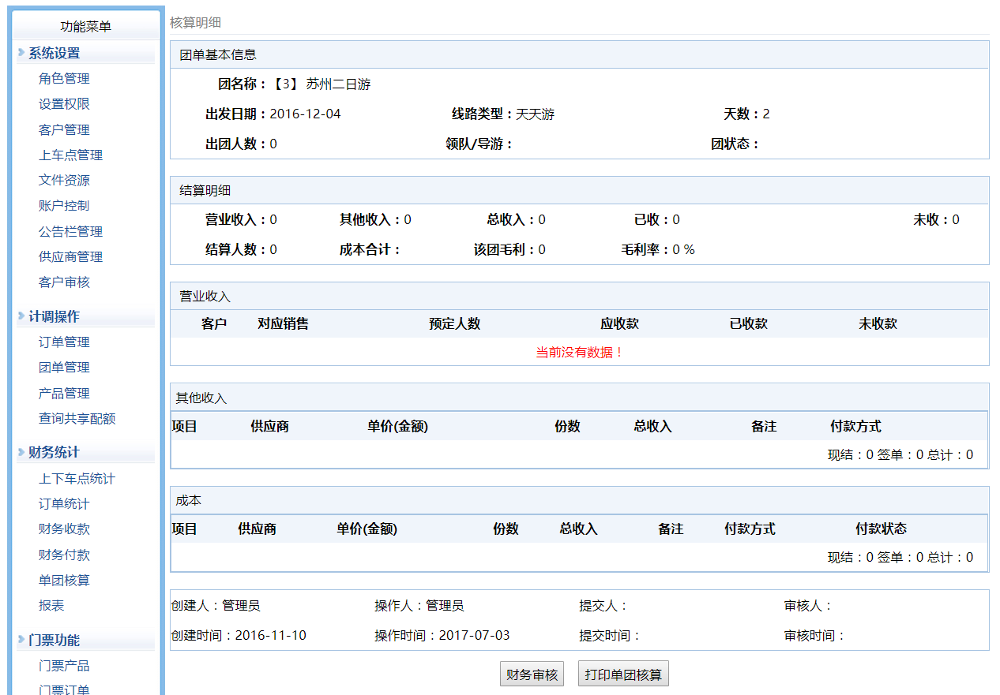
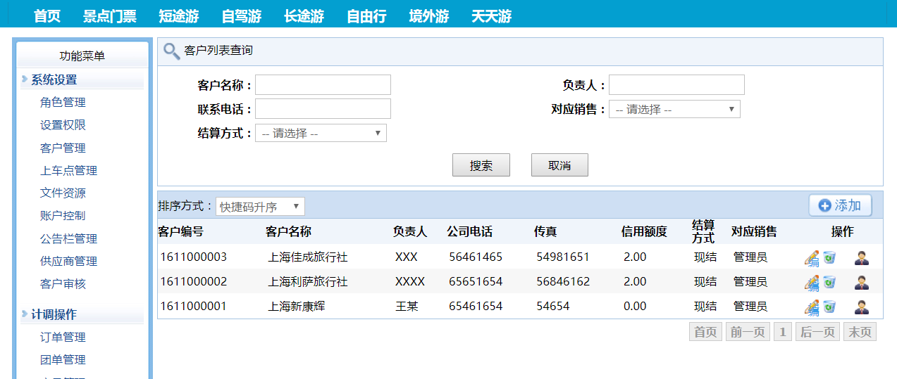

# 项目名称 (YuanTravel)

[](LICENSE)
[](#)
[](#)

> 旅行社管理、线路维护、度假产品的下单系统。

##  特性 (Features)

- 十多年前的系统，开放给大家。

##  快速开始 (Getting Started)

### 环境要求 (Prerequisites)

- .Net Framework >= 4.6.2

### 安装 (Installation)

```bash
# 克隆仓库
git clone https://github.com/stevenzh/YuanTravel.git
cd YuanTravel

# 安装依赖
启动 Microsoft Visual Studio 打开项目文件 src/YuanTravel.sln

```
# 截图


